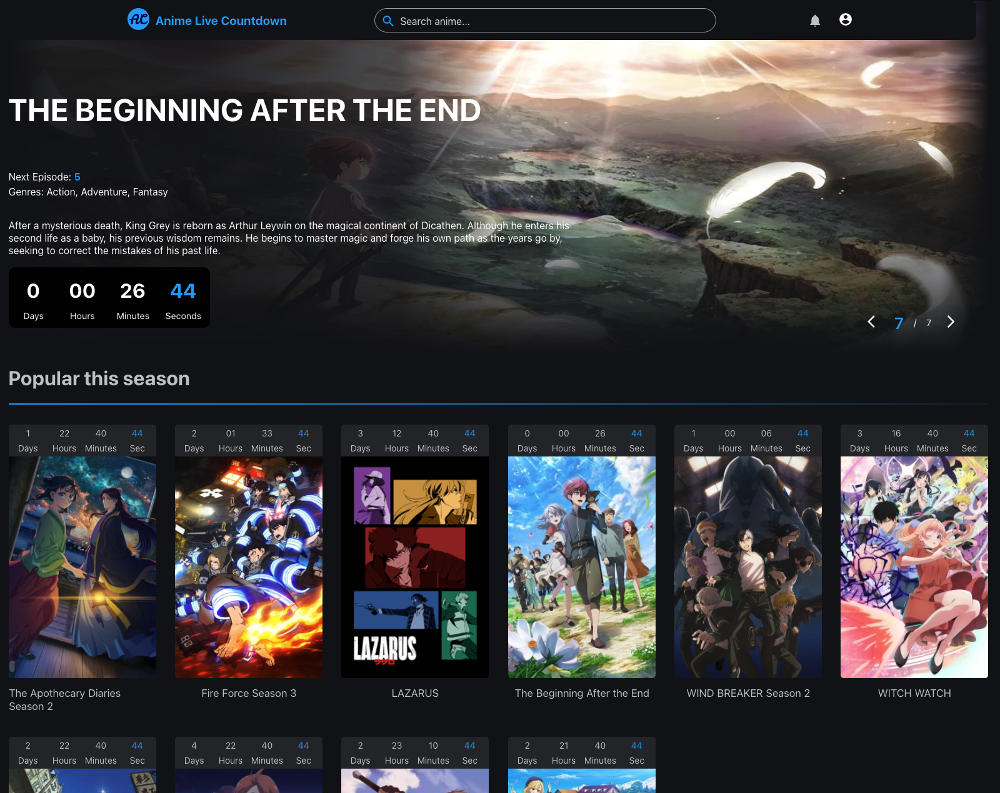

<div align="center">
  

  # Anime Live Countdown

  **A modern web application to track upcoming seasonal anime with real-time countdowns**

  [](https://angular.dev/)
  [](https://spring.io/projects/spring-boot)
  [](https://www.postgresql.org/)
  [](https://aws.amazon.com/)
  [](https://vercel.com/)

</div>

---

## 📖 About The Project

<div align="center">
  
</div>

<br>

Anime Live Countdown is a user-friendly web application designed to help anime fans track upcoming shows in the current season. What sets this platform apart is its unique **day-of-the-week grouping system**, which gives countdown timers meaningful context by showing when each anime airs throughout the week.

### ✨ Key Features

- 📅 **Weekly Schedule View** - Shows organized by day of the week for easy planning
- ⏱️ **Live Countdowns** - Real-time timers for upcoming episode releases
- 🔍 **Advanced Search** - Search and filter anime from the database
- 🎭 **Detailed Media Pages** - Comprehensive information about each anime
- 👤 **User Authentication** - Secure sign-in with user profiles
- ⭐ **Favorites System** - Save and track your favorite shows
- 📱 **Responsive Design** - Optimized for mobile, tablet, and desktop
- 🎨 **Modern UI** - Built with Angular Material and PrimeNG

---

## 🛠️ Built With

### Frontend
- **[Angular 20.3](https://angular.dev/)** - Modern web framework with SSR support
- **[Angular Material 20.2](https://material.angular.dev/)** - Material Design components
- **[PrimeNG 20.4](https://primeng.org/)** - Rich UI component library
- **[RxJS 7.8](https://rxjs.dev/)** - Reactive programming library
- **[TypeScript 5.9](https://www.typescriptlang.org/)** - Type-safe JavaScript

### Backend
- **[Spring Boot 3.4](https://spring.io/projects/spring-boot)** - Java backend framework
- **[Spring Security](https://spring.io/projects/spring-security)** - Authentication & authorization
- **[Spring Data JPA](https://spring.io/projects/spring-data-jpa)** - Database abstraction layer
- **[PostgreSQL](https://www.postgresql.org/)** - Relational database
- **[Maven](https://maven.apache.org/)** - Dependency management

### Infrastructure & Deployment
- **[Vercel](https://vercel.com/)** - Frontend hosting with SSR
- **[AWS](https://aws.amazon.com/)** - Backend hosting and services
- **[Docker](https://www.docker.com/)** - Containerization
- **[Express](https://expressjs.com/)** - SSR server

---

## 📁 Project Structure

```
AnimeLiveCountdown/
├── animeCountdownApp/          # Angular Frontend Application
│   ├── src/
│   │   ├── app/
│   │   │   ├── auth/           # Authentication components
│   │   │   ├── favorites/      # User favorites page
│   │   │   ├── footer/         # Footer component
│   │   │   ├── header/         # Navigation & search
│   │   │   │   ├── searchbar/  # Search functionality
│   │   │   │   ├── sign-in/    # Sign-in modal
│   │   │   │   └── profile-dropdown/
│   │   │   ├── home/           # Main landing page
│   │   │   │   ├── weekly-schedule/
│   │   │   │   │   ├── airing-soon/    # Upcoming releases
│   │   │   │   │   ├── shows/          # Weekly schedule grid
│   │   │   │   │   └── trending/       # Trending anime section
│   │   │   │   └── shared-home/        # Shared components
│   │   │   ├── media-info/     # Detailed anime pages
│   │   │   ├── models/         # TypeScript interfaces
│   │   │   ├── services/       # API & business logic
│   │   │   └── interceptors/   # HTTP interceptors
│   │   └── public/             # Static assets
│   ├── vercel.json             # Vercel deployment config
│   ├── package.json            # Frontend dependencies
│   └── tsconfig.json           # TypeScript configuration
│
├── animeCountdownBackend/      # Spring Boot Backend API
│   ├── src/
│   │   ├── main/
│   │   │   ├── java/           # Java source code
│   │   │   └── resources/      # Application configs
│   │   └── test/               # Backend tests
│   ├── Dockerfile              # Backend containerization
│   ├── docker-compose.yml      # Local development setup
│   └── pom.xml                 # Maven dependencies
│
├── .github/                    # GitHub workflows & configs
├── LICENSE                     # MIT License
└── README.md                   # This file
```

---

## 🚀 Getting Started

### Prerequisites

- **Node.js** 18+ and npm
- **Java** 17+ and Maven
- **PostgreSQL** 14+
- **Docker** (optional, for containerized setup)

### Frontend Setup

```bash
cd animeCountdownApp
npm install
npm start
```

The application will be available at `http://localhost:4200/`

### Backend Setup

```bash
cd animeCountdownBackend
./mvnw spring-boot:run
```

The API will be available at `http://localhost:8080/`

### Docker Setup (Optional)

```bash
cd animeCountdownBackend
docker-compose up
```

---

## 🗺️ Roadmap

### ✅ Completed Features

- [x] **Search Functionality**
  - [x] Real-time search bar with autocomplete
  - [x] Database filtering and query optimization
  - [x] Detailed media information pages
- [x] **User Authentication**
  - [x] Secure sign-in/sign-up system
  - [x] JWT-based authentication
  - [x] User profile management
- [x] **Weekly Schedule**
  - [x] Day-of-week organization
  - [x] Live countdown timers
  - [x] Airing soon section
- [x] **Favorites System**
  - [x] Save favorite anime
  - [x] Personal favorites page
- [x] **Responsive Design**
  - [x] Mobile-first approach
  - [x] Dynamic navbar (hides on scroll down, shows on scroll up)
  - [x] Optimized layouts for all screen sizes

### 🚧 In Progress

- [ ] **Push Notifications**
  - [ ] Email notifications for new episodes
  - [ ] Browser push notification support
  - [ ] Customizable notification preferences
- [ ] **English Dub Filter**
  - [ ] Toggle to show/hide dubbed anime
  - [ ] Dub release tracking
- [ ] **Enhanced Desktop Experience**
  - [ ] Multi-column layouts for large screens
  - [ ] Sidebar with quick filters
  - [ ] Picture-in-picture countdown widgets

### 🔮 Future Enhancements

- [ ] **Social Features**
  - [ ] User reviews and ratings
  - [ ] Watch lists and episode tracking
  - [ ] Community discussion boards
- [ ] **Advanced Filtering**
  - [ ] Genre-based filters
  - [ ] Studio and producer filters
  - [ ] Seasonal archive browsing
- [ ] **Personalization**
  - [ ] Theme customization (dark/light mode)
  - [ ] Customizable dashboard layouts
  - [ ] Watch history tracking
- [ ] **API Integration**
  - [ ] Public API for developers
  - [ ] Third-party integrations (MAL, AniList)
  - [ ] Webhook support

---

## 📄 License

Distributed under the MIT License. See [LICENSE](LICENSE) for more information.

---

## 🤝 Contributing

Contributions, issues, and feature requests are welcome! Feel free to check the issues page.

---

<div align="center">
  Made with ❤️ for the anime community
</div>
