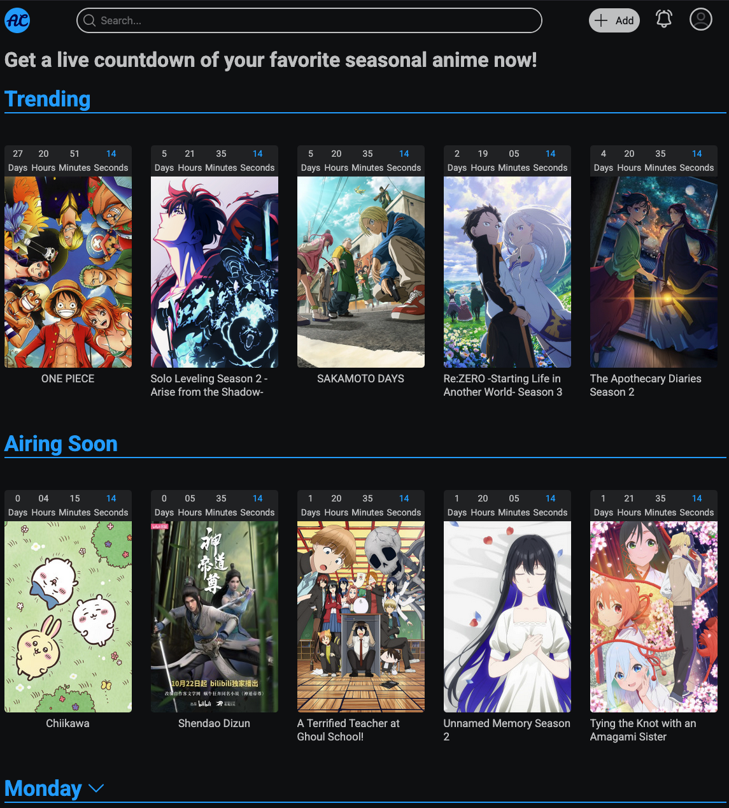

<h1 style="border-bottom: 0; text-align:center; margin-bottom: -30px;">Anime Countdown</h1>
<h2 style="border-bottom: 0; text-align:center; font-weight:normal; margin-bottom: 50px;">A simple website to help you keep track of upcoming seasonal anime!</h2>
<h1>About The Project</h1>

The purpose of this project is to provide a user friendly to view upcoming anime shows in the current season. So what makes this site different from the others that are out there, it groups the shows by days of the week. While this may seem simple it gives the numbers a meaning besides just a timer counting down, providing a more ease of use.

<h1 style="margin-top: 10px;">Made With</h1>
<ul>
    <li></li>
    <li>
    </li>
    <li>
    </li>
    <li>
    </li>
    <li>
    </li>
</ul>
<h1 style="margin-top: 10px;">Roadmap</h1>
<ol>
    <li>Add functionality to the search bar along with result page</li>
    <li>Add user sign-in and authentication</li>
    <li>Add notifications set up</li>
</ol>
